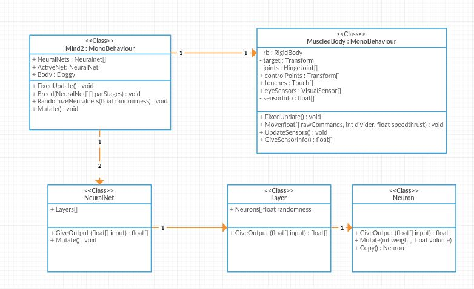

# Project Overview

This project was very challenging indeed. It consisted of four major parts. 

First thing was construct a rag-doll-type four-legged creature with Unity joints. But it had to be steerable with motors so no ordinary ragdoll could be used but I had to construct it with hinge-joints. 

The next thing to do was to implement the motor-system which could be given just an array of real-numbers and it would use them as impulses to the motors. However this proved to be very challenging and I quickly noticed that giving straight motor-speed and force orders couldn't do the task. That was because they were impossible to force to be within limits. I wanted that the machine could take input orders from -1 to 1 and react so that it would never try to exceed the joint limits. I finally found a way to interpret the input so that it was not used as force or speed, but a relative position of the joint. So number 1 would be the order to bend the joint all the way up but not further.

The third phase was to implement an easily extendable neural network which would have many functions for mutating and breeding. This was actually the easiest task. I made a Monobehaviour class Mind2 which had two of these networks and switched between them based on some sensorinfo. Mind2 also had acces to the mechanical Monobehaviour class "Doggy" containing the actual sensorinfo and the motorsystem.

Last but not least I had to design the actual game logic consisting of tuning the parameters and the shape of the networks, choosing the amount of the doggys and adjusting the eyesensors in the beginning of the game. After that started the actual game where I had to implement some kind of training tools. At the moment they are randomizing a new network, mutating an existing one with tunable parameters, cross breeding two or more units and finally generating the next generation.

## Class diagram of the interesting parts of the game.

## Technical choices

The game was made with Unity using it's physics engine and a lot of self implemented coding. I decided to use a Singelton class named Info. Through that I could access variables that had to be as global as possible and they had to follow from scene to scene. I decided not to use any fancy ready made assets. The only asset I used in addition the Unity game engine itself and it's components like U.I and terrain etc. was a 3d model apple which I asked my girlfriend to model with Blender. The doggy was made of Unity cubes and two balls as Eyes. The sensorinfo that the dog had was the current position of it's joints, basic raycastInfo "through eyes", the rotation of the torso and touch booleans for each limb.

## Technical Problems and Testing

Main problem with the game for now is bad interface. The use of UI is lousy because I have concentrated on other things. Especially there are problems with selecting the creatures as the UI elements harass the OnClick() -event on the creatures. Also the camera steering is a bad omåplementation from me. It needs to be more fun.

Unit tests can be done with Unity but I used I used them quite a little and mainly to check out if the Neural Networks behaved like they was supposed to. Instead I made a lot of debugging with Debug.Log() -function. There were so many issues that they are impossible to mention them all or it would take a book to write about them. Hardest things were coping with Unitys excecution order. I had to make sure that everything was constructed in right order so that there would be no null-pointers. In this complex construction it was sometimes hard. The last very annoying thing was that in the platform build the execution order was different from the editor play execution order. I had to read a lot of Log -reports and proceed line after line to find what happened in bug situations.
